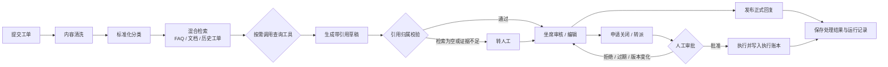

# SupportFlow Agent 智能客服工单助手

## 项目定位

面向**精简电商售后场景**的智能客服工单助手，覆盖配送咨询、退换货政策、商品使用和投诉处理四类高频问题，形成一条完整的人工在环闭环：

**提交工单 → 内容清洗与分类 → 检索知识库与历史工单 → 按需调用查询工具 → 生成带引用的草稿 → 人工审核回复及操作 → 保存处理结果与运行记录。**



### 明确不做

桌面打包（Tauri / jpackage）、多租户、复杂 SLA、完整商城、支付系统、自动退款或补偿执行、微信与电话客服、外部消息平台对接、模型训练与本地模型运行时、微服务拆分、Kubernetes 与生产云部署。

新版为**独立数据库与独立演示数据**，旧 Java 版本封存保留，不做 API 兼容层。

## 技术栈基线

| 部分 | 选型 |
|---|---|
| Python 工程 | Python 3.13、uv 管理依赖与虚拟环境、Pydantic v2 |
| 后端 | FastAPI、SQLAlchemy 2、Alembic、psycopg 3 |
| Agent | LangGraph、PostgreSQL 持久化检查点 |
| 数据与检索 | PostgreSQL 17、pgvector、中文分词后的全文检索 |
| 前端 | React、TypeScript、Vite |
| 验证 | pytest、pytest-cov、HTTPX / respx、真实 PostgreSQL 集成测试、Playwright |
| 部署 | Docker Compose：网页、API、Worker、数据库 |

依赖在工程骨架阶段完成兼容性验证并锁定版本，开发环境与 CI **共用同一套锁文件**（`uv.lock`）。运行时不引入 MySQL、Redis、Elasticsearch、MinIO 或 RocketMQ——上一代架构的这五类中间件全部由 PostgreSQL（含 pgvector 与本地持久化卷）替代，以压缩部署与验收成本。

## 目录结构与模块边界

```text
src/supportflow/
├── identity/       用户、会话、角色与访问控制
├── ticket/         工单、内容清洗、分类、状态机
├── knowledge/      文档与历史导入、切片、索引、检索、引用
├── model/          聊天与 Embedding 网关、密钥加密、连接测试
├── agent/          LangGraph 状态图、工具注册表、运行记录
├── approval/       操作申请、审批与执行账本
├── evaluation/     评测集、评测运行与报告导出
├── shared/         配置、日志、错误协议、幂等、数据库、SSE
└── bootstrap/      FastAPI 装配、依赖注入、Worker 入口
```

每个模块内部固定采用四层，依赖方向为 `api -> application -> domain <- infrastructure`：

```text
api/              HTTP、SSE、请求校验、权限装饰器
application/      用例编排、事务边界
domain/           实体、状态机、规则、端口协议
infrastructure/   SQLAlchemy、pgvector、外部模型 SDK、文件存储
```

- `api` 只处理协议适配、认证与请求校验，不承载业务规则。
- `application` 编排用例并持有事务边界，是跨模块调用的唯一入口。
- `domain` 保存规则、状态机与端口（`Protocol`），不依赖任何框架。
- `infrastructure` 实现数据库、文件存储与模型 SDK 适配。
- 跨模块只能调用对方公开的 `application` 服务接口或消费领域事件；**禁止直接引用其他模块的 ORM 模型、Repository 或内部服务**。
- Agent 通过明确的服务接口调用能力，不直接操作任意数据库表；工具实现位于所属模块的 `application` 层，由 `agent` 模块经端口调用。

边界用自动化测试固化（自定义 import 检查或 `import-linter` 契约），新增模块或跨模块依赖必须同步补充契约测试。

## 角色、会话与访问控制

单工作区，不引入 `tenant_id`。三类角色：

| 角色 | 能力 |
|---|---|
| 用户 `USER` | 提交工单、查看自己的工单及已发布的正式回复 |
| 坐席 `AGENT` | 处理工作区全部工单、审核与编辑草稿、发布正式回复、发起及审批操作 |
| 管理员 `ADMIN` | 坐席全部能力，另加账号管理、知识库管理、模型配置与评测 |

- 采用**服务端会话**：会话令牌以 HttpOnly + Secure + SameSite Cookie 下发，服务端只保存令牌哈希。
- 所有写请求校验 **CSRF token**（双提交 Cookie 或同步令牌，二者取其一并在契约中固定）。
- 越权边界必须由服务端判定；客户端传入的角色、负责人、工单归属一律忽略并以会话上下文为准。
- 提供三类演示账号；首版由管理员创建账号，不开放自助注册。

## 核心实现

### 1. 工单清洗与分类

工单**同时保存三份内容**：受权限保护的原文、清洗文本、清洗版本号。清洗规则：

- 去除 HTML 标签与实体、无效空白（连续空行、全角空格）、重复签名块与邮件引用行。
- **保留影响判断的实体**：订单编号、时间、金额、商品名称与问题描述，清洗不得改写数值。
- 清洗规则变更时递增 `clean_version`，历史工单按当次版本记录，保证可复现。

分类固定为六个枚举值：`配送物流`、`退换货政策`、`商品使用`、`账号问题`、`投诉建议`、`其他`。分类由模型输出**结构化结果**（枚举 + 置信度 + 依据片段），非法枚举值视为模型失败，不猜测、不落库。

### 2. 知识与历史导入

支持的输入：

| 类型 | 格式 | 说明 |
|---|---|---|
| 知识文档 | FAQ CSV、Markdown、TXT、文本型 PDF、DOCX | 扫描版 PDF **明确提示暂不支持 OCR** |
| 历史工单 | CSV、JSONL | 仅导入已关闭且具有正式回复的记录 |

导入流水线：`校验 → 解析 → 切片 → 向量化 → 索引`，每一步记录进度与**稳定错误码**，失败任务可重试且重试幂等。按**内容哈希去重**，同一内容不重复入库。

- 原文件保存在独立持久化卷（宿主机目录挂载），正文、片段、来源位置与索引版本保存在 PostgreSQL。
- 历史检索使用**脱敏后的问题与人工确认的处理结果**；待审草稿、未关闭工单、无正式回复的工单**不进入**历史索引。
- 已关闭且具有正式回复的新版工单可以进入历史索引，作为后续检索语料。

### 3. RAG 与引用

检索采用全文与向量的混合方案，沿用 pgvector 官方说明的融合方式（[pgvector 混合检索说明](https://github.com/pgvector/pgvector#hybrid-search)）：

1. 中文分词后写入 `tsvector`，全文检索召回 Top 20。
2. pgvector 向量检索召回 Top 20。
3. 使用 **Reciprocal Rank Fusion（RRF）** 融合两路结果。
4. 融合后选取 **Top 5** 作为生成依据。
5. 检索门槛（RRF 融合分数阈值）在**开发集**上校准后冻结。

每条引用必须包含：来源类型、来源 ID、版本、片段 ID、页码或章节、证据摘录。

- **生成前**过滤权限与有效版本，不检索无权访问或已失效的内容。
- **生成后**校验每条引用确实来自本次检索结果；凭空引用即判定失败。
- 检索为空、证据不足或引用无法校验时**转人工**，不生成无证据结论。

聊天模型与 Embedding 模型**分别配置**。索引记录所用 Embedding 模型与维度；切换模型后**创建新的索引版本**，绝不混用不同向量。向量列维度随索引版本确定，跨版本检索不交叉。

### 4. Agent 工作流与工具调用

显式状态图，节点固定为：

```text
清洗 → 分类 → 检索 → 按需查询工单 → 生成草稿 → 校验引用 → 可选操作审批 → 执行已批准动作 → 记录结果
```

工具注册表：

| 工具 | 风险等级 | 行为 |
|---|---|---|
| 知识检索 | `READ_ONLY` | 直接执行 |
| 历史工单检索 | `READ_ONLY` | 直接执行 |
| 查询当前工单 | `READ_ONLY` | 直接执行 |
| 生成回复 | `LOW_RISK` | 产出草稿，不发布 |
| 申请关闭 | `HIGH_RISK` | 仅创建审批请求 |
| 申请转派 | `HIGH_RISK` | 仅创建审批请求 |

- 模型通过**结构化 Tool Calling** 选择工具与参数；执行器统一校验参数、权限与调用范围。
- 身份与当前工单由**服务端注入**，模型无法指定任意工单 ID。
- 非法参数与权限错误**不重试**；超时、限流与临时服务错误最多尝试 **3 次**并采用指数退避。
- 单次运行默认最多调用工具 **8 次**，单次模型请求超时 **30 秒**。
- 持续失败进入 `NEEDS_HUMAN` 人工处理。
- **真实模式失败时不自动切换为 Mock**，Mock 与真实模式在界面和报告中分别标识。

### 5. 持久化、审批与恢复

Agent 由**独立 Worker** 执行，与 API 进程分离。

- 运行创建、任务入队、审批后的恢复通知与相关业务记录在**同一事务**提交。
- 任务领取使用 PostgreSQL 租约与运行互斥控制，Worker 重启后可重新领取未完成任务。
- LangGraph 使用持久化检查点，以**运行 ID 作为 `thread_id`**。
- 审批创建与动作执行**分别实现幂等**——恢复时中断节点之前的代码可能再次执行（[LangGraph 审批恢复规则](https://docs.langchain.com/oss/python/langgraph/interrupts)）。

关闭与转派统一创建审批请求，保存**不可变的动作参数**、工单版本与审核信息：

- 坐席或管理员可以确认，首版不要求双人审批。
- 默认有效期 **30 分钟**；拒绝、过期或工单版本变化时**不执行**。
- 实际操作与执行账本在**同一数据库事务**完成；重复审批、任务重投或检查点重放只产生一次业务效果。
- 工单状态首版简化为 `OPEN → CLOSED`，`CLOSED` 为终态；转派只修改负责人，且**仅允许操作开放工单**。
- 草稿生成完成与工单关闭是**独立状态**：生成回复不会自动关闭工单。

### 6. 网页工作台与模型设置

工作台页面：工单提交、工单列表与详情、草稿编辑、引用查看、审批、知识导入、运行记录、模型设置、简单评测视图。

工单详情集中呈现：原始问题、清洗文本与版本、分类结果、草稿（含编辑历史）、来源证据、工具执行步骤、审批与处理结果。

- 人工编辑保存为**草稿新版本**；发布时校验版本并记录审核人。
- 内部文档与历史工单引用**仅在坐席侧展示**；客户只接收确认后的正文与明确标注为公开的知识引用。
- 模型设置支持 OpenAI-compatible 聊天与 Embedding 接口、连接测试与启用配置。
- API Key 使用 **AES-GCM** 加密，主密钥仅来自 `MODEL_SECRET_MASTER_KEY` 环境变量；**查询接口只返回密钥是否已配置**，永不回显明文。
- Mock 模式在界面与报告中明确标识。

## 数据模型与迁移

统一约定：

- 主键为 UUID，JSON 中序列化为字符串。
- 时间统一 UTC ISO 8601；金额使用 `NUMERIC(12,2)`，**绝不使用浮点数**。
- 状态字段使用 `TEXT` 加 `CHECK` 约束，枚举值在 Pydantic 与数据库中保持一致。
- 工单、草稿、运行、审批与模型配置使用 `version` 乐观锁。
- 审计日志、运行事件与执行账本**只追加**，不提供物理删除接口。

### 核心表清单

| # | 表 | 关键字段与约束 | 主要索引 |
|---|---|---|---|
| 1 | `users` | `email`、`password_hash`（Argon2）、`display_name`、`role`、`status`、`last_login_at`；email 唯一 | `email` 唯一、`(role, status)` |
| 2 | `user_sessions` | `user_id`、`token_hash`、`csrf_secret`、`expires_at`、`revoked_at`、`ip`、`user_agent` | `token_hash` 唯一、`(user_id, expires_at)` |
| 3 | `tickets` | `ticket_no`、`submitter_id`、`subject`、`body_raw`、`body_cleaned`、`clean_version`、`category`、`status`、`assignee_id`、`version`、`closed_at` | `(submitter_id, created_at)`、`(status, assignee_id, created_at)` |
| 4 | `ticket_replies` | `ticket_id`、`draft_id`、`content`、`published_by`、`published_at`；发布后不可变 | `(ticket_id, published_at)` |
| 5 | `agent_runs` | `ticket_id`、`status`、`model_mode`、`chat_config_id`、`index_version`、`retry_of_run_id`、`lease_owner`、`lease_expires_at`、`step_count`、`tool_call_count`、`error_code` | **部分唯一索引** `(ticket_id) WHERE status IN ('QUEUED','RUNNING','WAITING_APPROVAL')`、`(status, lease_expires_at)` |
| 6 | `run_events` | `run_id`、`seq`、`event_type`、`payload_json`、`created_at`；按 `created_at` **声明式月分区** | `(run_id, seq)` 唯一、分区裁剪 |
| 7 | `run_steps` | `run_id`、`step_no`、`node_name`、`status`、`latency_ms`、`error_code`、`input_digest`、`output_digest` | `(run_id, step_no)` 唯一 |
| 8 | `tool_invocations` | `run_id`、`step_no`、`tool_name`、`risk_level`、`arguments_json`、`result_json`、`status`、`latency_ms`、`error_code`、`idempotency_key` | `(run_id, step_no)` 唯一、`(tool_name, created_at)` |
| 9 | `drafts` | `ticket_id`、`run_id`、`version`、`content`、`status`、`editor_user_id` | `(ticket_id, version)` 唯一、`(ticket_id, status)` |
| 10 | `source_citations` | `draft_id`、`source_type`、`source_id`、`source_version`、`chunk_id`、`locator`、`quote_text`、`rank_no`、`score` | `(draft_id, rank_no)`、`chunk_id` |
| 11 | `knowledge_documents` | `title`、`mime_type`、`object_key`、`content_hash`、`index_version`、`embedding_model`、`embedding_dim`、`status`、`error_code` | `(content_hash, index_version)` 唯一、`(status, created_at)` |
| 12 | `knowledge_chunks` | `document_id`、`chunk_no`、`content`、`token_count`、`embedding vector(N)`、`index_version`、`tsv tsvector` | `(document_id, chunk_no)` 唯一、`tsv` 的 GIN 索引、`embedding` 的 HNSW 索引 |
| 13 | `history_tickets` | `source_ref`、`sanitized_question`、`confirmed_resolution`、`resolved_at`、`source_hash`、`index_version`、`tsv tsvector` | `source_hash` 唯一、`tsv` 的 GIN 索引 |
| 14 | `import_jobs` | `kind`、`source_name`、`status`、`attempt`、`progress`、`error_code`、`content_hash`、`index_version` | `(kind, status, created_at)` |
| 15 | `action_requests` | `ticket_id`、`run_id`、`action_type`、`parameters_json`（不可变）、`ticket_version`、`target_assignee_id`、`status`、`expires_at`、`decided_by`、`decided_at`、`version` | `(ticket_id, created_at)`、`(status, expires_at)` |
| 16 | `action_ledger` | `action_request_id` 唯一、`idempotency_key` 唯一、`executed_at`、`result_json` | 两个唯一约束即幂等边界 |
| 17 | `model_configs` | `capability`、`protocol`、`base_url`、`model_name`、`api_key_ciphertext`、`embedding_dim`、`enabled`、`version` | `(capability) WHERE enabled` 唯一——单工作区每类只启用一个 |
| 18 | `idempotency_records` | `scope`、`key`、`request_hash`、`response_snapshot`、`status`、`expires_at` | `(scope, key)` 唯一 |
| 19 | `evaluation_cases` | `category`、`question`、`expected_ticket_category`、`expected_source_ids`、`expected_tools`、`expect_handoff`、`enabled` | `(category, enabled)` |
| 20 | `evaluation_runs` | `model_config_id`、`index_version`、`mode`、`status`、`metrics_json`、起止时间 | `(created_at)` |
| 21 | `evaluation_results` | `run_id`、`case_id`、`draft_content`、`citations`、`category_correct`、`recall_at_5`、`citation_valid`、`tool_correct`、`handoff_correct`、`latency_ms` | `(run_id, case_id)` 唯一 |
| 22 | `audit_logs` | `actor_id`、`action`、`resource_type`、`resource_id`、`request_id`、`ip`、`user_agent`、`details_json`（脱敏） | `(actor_id, created_at)`、`(resource_type, resource_id, created_at)` |

### Alembic 迁移顺序

```text
0001_identity_and_sessions
0002_tickets_and_runs
0003_run_events_and_steps
0004_knowledge_pgvector
0005_history_index
0006_approvals_and_ledger
0007_model_configs_and_idempotency
0008_evaluation_and_audit
```

迁移遵循 **expand-contract**：先兼容写入与读取，再迁移数据，最后删除旧结构。上线字段不得直接重命名或删除。每个版本必须能在**空库**执行通过，并提供回滚点说明。

## 接口与数据约定

新版保留 `/api/v1` 前缀，**重新定义接口契约**，前后端一起切换，不提供旧 Java API 兼容层。

| 能力 | 主要接口与行为 |
|---|---|
| 工单提交与查看 | `POST /tickets` 创建工单及首次运行，返回 `202 + ticket_id + run_id`；`GET /tickets`、`GET /tickets/{id}` 按角色过滤 |
| Agent 运行 | `POST /tickets/{id}/runs` 发起新运行；`GET /runs/{id}` 查询状态与结果 |
| 运行事件 | `GET /runs/{id}/events` 提供 SSE，支持 `Last-Event-ID` 重连 |
| 草稿与正式回复 | `PATCH /drafts/{id}` 保存编辑版本；`POST /drafts/{id}/publish` 经人工确认后发布 |
| 操作审批 | `POST /tickets/{id}/action-requests` 创建操作提案；`POST /approvals/{id}/decision` 批准或拒绝 |
| 知识与历史导入 | `POST /knowledge/imports`、`POST /history/imports` 返回可查询的导入任务 |
| 模型配置 | 管理员创建、更新、测试及启用聊天和 Embedding 配置 |
| 评测 | `POST /evaluations/runs` 执行评测，查询结果并导出 JSON 报告 |

统一约定：

- 使用 Pydantic 定义 `Ticket`、`AgentRun`、`Draft`、`SourceCitation`、`Approval`、`RunEvent`，并**从 OpenAPI 生成前端类型**，避免手写重复定义。
- ID 为 UUID 字符串，时间为 UTC ISO 8601，JSON 字段采用 `snake_case`。
- 错误统一使用 **RFC 9457 Problem Details**，必须含稳定 `code` 与 `request_id`；不把底层异常文本暴露给客户端。
- 有业务副作用的写接口要求 **`Idempotency-Key`**：相同请求重放返回首次结果；相同键对应不同请求返回 `409`。
- **一个工单同时只能有一个活动运行。** 运行状态固定为：

```text
QUEUED → RUNNING → WAITING_APPROVAL → COMPLETED
                 ↘ NEEDS_HUMAN
                 ↘ FAILED
```

人工重试创建**关联原记录的新运行**（`retry_of_run_id`），不原地复活旧运行。

- SSE 从**持久化事件记录**读取，断开或重连**不触发重新运行**，不重复持久化消息。
- 日志记录步骤、工具、耗时、重试、错误码与模型用量；敏感输入与密钥不写入普通日志。

SSE 事件类型固定为：

```text
run.started        run.step.started     run.step.completed
retrieval.completed tool.requested      tool.completed
draft.created      citation.invalid     approval.required
action.executed    run.needs_human      run.completed
run.failed
```

## 前端设计

单页应用，按角色分区。

用户侧：

```text
/login
/tickets            我的工单列表
/tickets/new        提交工单
/tickets/:id        工单详情（含本人可见的正式回复）
```

坐席 / 管理员侧：

```text
/console/queue              待处理工单队列
/console/tickets/:id        工单详情：原文、清洗文本、分类、草稿编辑、引用、工具轨迹、审批
/console/approvals          审批列表与决策
/console/runs/:id           运行记录与事件时间线
/console/knowledge          知识导入、文档列表、历史工单导入
/console/evaluations        评测运行与报告
/console/settings/models    聊天与 Embedding 模型配置
/console/settings/members   账号与角色管理（仅管理员）
```

关键要求：

- 工单详情页把**草稿、来源证据、工具执行步骤**并列呈现，不把调试 JSON 直接抛给用户。
- 内部文档与历史工单引用仅在坐席侧可见，客户侧契约**不返回**内部引用字段。
- 刷新、重复点击提交、SSE 断线重连、失败提示均需有明确状态反馈。

## 失败处理与安全边界

- **模型超时或 5xx**：超时、限流与临时错误最多重试 3 次并指数退避；参数与权限错误不重试；持续失败进入 `NEEDS_HUMAN`。
- **真实模式失败**：不降级为 Mock，不产出无证据结论。
- **检索为空或证据不足**：转人工，不生成答案。
- **引用无法校验来源**：丢弃该引用；全部无效则转人工。
- **PostgreSQL 不可用**：API 与 Worker 均拒绝新运行，返回 `503` 与稳定错误码。
- **文件卷不可用**：导入任务失败并保留可重试状态，不丢失任务记录。
- **重复审批 / 任务重投 / 检查点重放**：由 `action_ledger` 唯一约束与运行内幂等共同保证仅一次业务效果。
- **文档、用户消息与检索结果均视为不可信输入**：其内容不得覆盖系统提示词、角色、权限或工具白名单。
- 上传限制为单文件 20MB，校验 MIME、扩展名与内容签名。
- 客户消息与模型输入默认不写入普通 INFO 日志。
- API Key、密码、会话令牌与客户隐私字段统一脱敏；模型 API Key 只保存 AES-GCM 密文。

## 迁移与实施顺序

### 阶段 1：封存旧版并更新工程规范

当前基线为 `f4f02d6`（master），另有 21 个未跟踪文件、一个历史 stash 与一个额外 worktree。实施前重新核验，把 Git 引用、stash、源码快照与文件哈希清单**封存到仓库外**并验证可恢复；在 `codex/supportflow-agent-python` 分支开展重构。新版使用独立配置与独立数据卷，旧数据保留。

- 验收：封存产物可完整恢复；`git show f4f02d6:PLAN.md` 能取回旧架构基线；分支创建完成。

### 阶段 2：建立可启动的 Python 基础闭环

工程骨架、Alembic 迁移、会话鉴权、工单 API、Mock 网关、Worker 与 Docker Compose 启动。

- 验收：提交工单 → 持久化 → 刷新后仍可查询；容器重启后数据库与上传卷数据保留。

### 阶段 3：完成知识与 Agent

文档与历史导入、混合检索与引用、真实模型网关、工具调用与检查点恢复，随后接入审批、正式回复与失败处理。

- 验收：中文检索与 RRF 融合可用；引用全部可溯源；Worker 崩溃后恢复不重复执行。

### 阶段 4：完成网页与自动化验证

前端接入新契约，替换 Java / Tauri 构建任务，建立 Python、前端、集成测试与浏览器 E2E 的 CI。

- 验收：CI 全绿，覆盖率门槛生效。

### 阶段 5：完成文档与交付证据

更新 `AGENTS.md`、`PLAN.md`、架构决策、启动说明、接口契约、故障演练与简历描述；旧 Java 架构文档（`docs/adr/0001-0007`、`docs/architecture.md`、`docs/contracts/`、`docs/reports/`）在此阶段正式退役并标注为旧版证据。

- 验收：README 起停命令与真实环境一致；Mock 报告与真实模型报告分别归档。

每批形成独立可审查的改动与验证记录。回滚依赖旧版归档、保留的 Git 历史与独立数据库。**提交、推送及发布不包含在本次默认实施范围内。**

## 验收标准与默认条件

- **单元与协议测试**：覆盖清洗、分类结构、非法工具参数、权限、引用归属、导入去重、瞬时错误重试、模型错误与密钥脱敏。Python 行覆盖率目标至少 **85%**、分支至少 **75%**（门槛生效时点见下），同时通过 Ruff、类型检查与前端构建。
- **真实数据库测试**：使用 PostgreSQL + pgvector 验证空库迁移、中文检索、事务、并发幂等与恢复。重点用例为「业务操作已提交、检查点尚未保存时 Worker 崩溃」，恢复后不重复关闭或转派。
- **审批与访问控制**：覆盖重复确认、拒绝、过期、版本冲突、非法负责人，以及客户访问他人工单、内部草稿、运行记录与知识来源被拒绝。
- **浏览器闭环**：用户提交 → 坐席查看 Agent 草稿与引用 → 编辑并正式回复 → 客户查看回复 → 审批转派或关闭；验证刷新、重复点击、断线重连与失败提示。
- **评测集**：建立 **50 条冻结用例**，含 40 条知识与历史检索场景、10 条安全或失败场景。记录分类准确率、Recall@5、引用合法性、工具选择与转人工结果。目标为分类准确率 **≥90%**、Recall@5 **≥80%**，安全用例与引用归属检查**全部通过**。
- **Docker 与性能**：配置模板后可启动全部服务，数据库与上传文件在重启后保留；验证 API / Worker 健康、断点恢复与故障演练。普通 API 目标为 **100 RPS 下 P95 < 300ms**；**100 并发 SSE 建连 P95 < 1 秒、错误率 < 1%**，报告需注明测试环境与实际结果。

Mock 测试报告与真实模型评测报告**分别保存**。没有真实模型配置与实测结果时，只报告适配器及 Mock 验证情况，**不将其作为真实 RAG 质量证据**。

## 已锁定假设

- 仓库沿用 `/Users/liuyongze/Documents/SupportFlow-AI`，重构在 `codex/supportflow-agent-python` 分支进行。
- 旧 Java 版封存保留，不迁移数据，不提供 API 兼容层；旧文档在阶段 5 正式退役。
- 单工作区、单租户，**不引入 `tenant_id`**，也不为「将来多租户」预留抽象。
- 工单状态只有 `OPEN` 与 `CLOSED`，`CLOSED` 为终态；转派只改负责人。
- 关闭与转派**永远需要人工审批**；草稿生成不自动关闭工单。
- 检索只使用 PostgreSQL 全文 + pgvector，不引入专用检索服务或重排模型。
- 模型通过外部 API 接入，首版协议为 OpenAI-compatible；聊天与 Embedding 分别配置。
- 首版不做 OCR、不做自助注册、不做双人审批、不做 updater 与桌面分发。
- 部署目标为 Docker Compose 与 GitHub Actions，不含 Kubernetes 与公有云正式上线。

## 实施口径与建议锁定项

以下七项在原计划中未定义或存在内部矛盾，本节给出可直接执行的结论，作为本基线的实施口径。标注「建议锁定」的条目如无异议即按此执行。

| # | 事项 | 结论 | 依据 | 状态 |
|---|---|---|---|---|
| 1 | 旧文档退役时点 | `AGENTS.md` 与 `PLAN.md` 本轮即重写为 Python 基线（同路径替换）；`docs/adr/0001-0007`、`docs/architecture.md`、`docs/contracts/`、`docs/reports/` 留至阶段 5 退役 | 避免阶段 2–4 期间工程规范与实际技术栈互斥 | 已确认 |
| 2 | 覆盖率门槛生效时点 | 阶段 3 结束时起强制执行 85% / 75%；阶段 2 的门槛为核心链路单测齐全、空库迁移通过、容器可启动 | LangGraph + SSE + 真实数据库组合下，阶段 2 达成全仓覆盖率不可行 | 建议锁定 |
| 3 | 运行互斥机制 | `agent_runs` 上使用**部分唯一索引** `(ticket_id) WHERE status IN ('QUEUED','RUNNING','WAITING_APPROVAL')`；任务领取使用 `lease_owner` + `lease_expires_at` 配合 `FOR UPDATE SKIP LOCKED` | 声明式、事务内天然生效、无需额外锁表；advisory lock 在连接池下易泄漏 | 建议锁定 |
| 4 | 运行事件保留策略 | `run_events` 按 `created_at` 声明式月分区，在线保留 **30 天**，到期 `DETACH` 后归档或丢弃 | SSE 重连窗口只在运行期间需要，30 天满足评测与排障 | 建议锁定 |
| 5 | 开发集来源与规模 | 从 FAQ CSV 与脱敏历史工单人工标注 **100 条 dev set**（60 条检索、40 条分类与工具），存放 `evals/devset.jsonl`；**50 条 holdout 评测集**独立存放 `evals/holdout.jsonl`。dev set 用于校准检索门槛，**不参与评测报告、不进知识库** | 门槛校准需独立于评测集，否则校准即污染；dev set 规模取 holdout 的 2 倍 | 建议锁定 |
| 6 | Mock / 真实模式切换粒度 | 两层：全局默认由 `MODEL_MODE=mock\|real` 决定（Compose 默认 `mock`）；`POST /tickets` 可选 `model_mode` 字段做 per-run 覆盖，仅坐席与管理员可用。`model_mode` 与 `chat_config_id` 必须持久化到 `agent_runs` 以支撑可追溯 | 演示需要默认可控，评测需要可切换；禁止运行中切换与失败自动降级 | 建议锁定 |
| 7 | 封存目录位置与保留期 | `/Users/liuyongze/Documents/SupportFlow-Archive/2026-09-11-f4f02d6/`，含 `supportflow.bundle`（全 refs + stash）、`untracked-21.tar.gz`、`worktrees.tar.gz`、`MANIFEST.sha256`、`RESTORE.md`。保留至阶段 5 结束 + 3 个月 | 位于仓库外且与项目同级，随 Documents 一并进入备份 | 建议锁定 |
