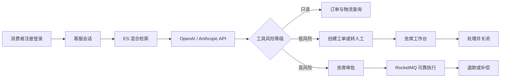

# SupportFlow AI 企业级电商售后客服与工单协同平台

## 项目定位

新建独立仓库 `/Users/liuyongze/Documents/SupportFlow-AI`，不复用或修改现有 `Ai-Agent`。项目采用模块化单体，重点展示 Java 企业后端、AI 多协议接入、RAG、RocketMQ 可靠消息、多租户隔离、工单 SLA 和高风险操作审批。

核心闭环：



明确不做完整商城、支付系统、微信客服、电话客服、模型训练、自动执行退款、微服务拆分和 Kubernetes 部署。

## 技术基线

- 后端：Java 21、Spring Boot 3.5.14、Spring MVC、虚拟线程、Spring Security、MyBatis-Plus、Flyway、Spring Modulith。
- AI：统一 `ModelGateway`，通过 API 支持 `OPENAI_COMPATIBLE` 和 `ANTHROPIC_MESSAGES`；Embedding 首版使用 OpenAI-compatible 协议。
- 数据：MySQL 8.4 LTS、Redis 7、Elasticsearch 8、MinIO。
- 消息：RocketMQ 5，使用事务外盒、延时消息、消费幂等和死信队列。
- 前端：React 19、TypeScript、Vite，一个应用内提供消费者端和坐席端路由。
- 测试：JUnit 5、Mockito、Testcontainers、WireMock、Playwright、k6。
- 可观测性：Micrometer、Prometheus、Grafana、结构化日志和全链路 `requestId`。

后端使用 Spring MVC 处理业务事务，开启 Java 21 虚拟线程；模型流式 API 使用 `WebClient`，不在 Reactor 线程执行 MyBatis 或其他阻塞数据库操作。

## 模块设计

统一目录结构：

```text
backend/src/main/java/com/lqq/supportflow/
├── identity/
├── model/
├── commerce/
├── knowledge/
├── conversation/
├── action/
├── ticket/
├── eventing/
├── evaluation/
├── shared/
└── bootstrap/
```

每个业务模块内部固定采用：

```text
api/              REST、SSE、请求校验
application/      用例编排、事务边界
domain/           聚合、状态机、策略、端口
infrastructure/   MyBatis、Redis、ES、MQ、外部 API
```

依赖方向固定为 `api -> application -> domain <- infrastructure`。跨模块只能调用公开 application 接口或发布领域事件，禁止直接访问其他模块的 Mapper、Entity 或内部 Service。通过 Spring Modulith 和 ArchUnit 测试强制边界。

### 1. Identity 模块

负责租户、用户、登录和权限。

- 租户管理员注册时一次性创建租户、管理员用户和成员关系。
- 消费者通过 `tenantCode + email + password` 注册。
- 坐席和主管账号由租户管理员创建。
- 固定角色：`TENANT_ADMIN`、`SUPERVISOR`、`AGENT`、`CUSTOMER`。
- JWT access token 有效期 15 分钟，refresh token 有效期 7 天并轮换。
- Refresh token 只保存 SHA-256 哈希，登出、改密和禁用用户时立即吊销。
- `tenantId`、`membershipId` 和角色来自认证上下文，普通接口不接受客户端传入的 `tenantId`。
- MyBatis-Plus 租户拦截器自动追加 `tenant_id`，原生 SQL 必须通过专用审计测试。

### 2. Model 模块

负责模型配置、协议适配、流式事件归一化和密钥保护。

公开领域端口：

```java
interface ChatModelGateway {
    Flux<ModelEvent> stream(ChatModelRequest request);
}

interface EmbeddingGateway {
    List<float[]> embedBatch(EmbeddingRequest request);
}
```

首版协议：

- `OPENAI_COMPATIBLE`：Chat Completions、流式 SSE、tool calls、Embeddings。
- `ANTHROPIC_MESSAGES`：Messages API、流式事件、tool use；不承担 Embedding。

统一模型事件：

- `TextDelta`
- `ToolCallStarted`
- `ToolCallArgumentsDelta`
- `ToolCallCompleted`
- `UsageReported`
- `ModelCompleted`
- `ModelFailed`

模型配置按租户保存，API Key 使用 AES-GCM 加密，主密钥仅由 `MODEL_SECRET_MASTER_KEY` 环境变量提供。查询接口永不返回密钥明文。

配置 Base URL 时必须使用 HTTPS；生产配置拒绝回环地址、私网地址和重定向到私网，开发环境通过明确白名单放行。

### 3. Commerce 模块

只实现客服需要的 Mock Commerce Adapter，不开发商品、购物车和支付。

公开工具：

- `order.lookup`：读取订单详情，自动执行。
- `shipment.track`：读取物流状态，自动执行。
- `refund.checkEligibility`：检查退款资格，自动执行。
- `ticket.create`：创建售后工单，低风险自动执行并审计。
- `refund.request`：申请退款，高风险，必须审批。
- `compensation.issue`：发放补偿，高风险，必须审批。

消费者注册后自动生成可演示的订单和物流数据。Commerce 模块对外暴露端口，AI 模块不能直接访问订单表。

### 4. Knowledge 模块

负责知识库、文档摄取、切片、Embedding 和 Elasticsearch 索引。

摄取状态机：

`UPLOADED -> PARSING -> CHUNKING -> EMBEDDING -> INDEXING -> INDEXED`

失败进入 `FAILED`，保存错误码和可重试次数。

首版支持 PDF、DOCX、Markdown 和 TXT：

- 原文件保存到 MinIO。
- Apache Tika 提取正文。
- 使用 `content_hash` 阻止重复上传。
- 默认切片为 600 tokens、100 tokens overlap。
- MySQL 的 `knowledge_chunks.content` 是可重建索引的事实来源。
- Elasticsearch 索引是派生数据，允许整库重建。

检索流程：

1. 强制追加 `tenant_id` 和 `knowledge_base_id` 过滤。
2. BM25 召回 Top 20。
3. Dense Vector kNN 召回 Top 20。
4. 使用 Reciprocal Rank Fusion 合并。
5. 返回 Top 6 给模型。
6. 保存引用 chunk、文档、分数和排序。

首版不加入额外重排模型，避免扩大部署范围。

### 5. Conversation 模块

负责消费者会话、消息、SSE、引用和转人工。

消息发送分成两个接口：

1. `POST /api/v1/customer/conversations/{id}/messages` 持久化用户消息并返回 `202 Accepted` 和 `generationId`。
2. `GET /api/v1/customer/generations/{generationId}/events` 建立 SSE，可通过 `Last-Event-ID` 重连。

生成事件写入 Redis Stream，TTL 10 分钟。模型生成与 SSE 连接解耦，浏览器断线不会中止模型任务；重连后从最后事件继续读取。生成完成后持久化最终 AI 消息、Token 用量、延迟和引用。

会话状态：

- `AI_ACTIVE`
- `WAITING_AGENT`
- `HUMAN_ACTIVE`
- `CLOSED`

以下情况自动转人工：

- 用户明确要求人工客服。
- 检索证据不足。
- 模型调用连续失败。
- 高风险工具需要审批。
- 检测到投诉、威胁或强烈负面情绪。
- AI 无法确认退款资格。

### 6. Action 模块

负责工具调用、风险分级、审批和幂等。

风险策略固定为：

- `READ_ONLY`：订单、物流、资格查询，自动执行。
- `LOW_RISK`：创建工单、转人工，自动执行并写审计。
- `HIGH_RISK`：退款、补偿，只创建审批请求。

高风险执行流程：

`模型提出动作 -> 持久化工具调用 -> 创建审批 -> 坐席批准 -> 写 Outbox -> RocketMQ -> 幂等执行 -> 回写结果`

审批状态：

- `PENDING`
- `APPROVED`
- `REJECTED`
- `EXPIRED`
- `EXECUTING`
- `EXECUTED`
- `FAILED`

审批有效期默认 30 分钟。批准、拒绝和执行接口必须携带 `Idempotency-Key`，重复请求返回第一次执行结果。

### 7. Ticket 模块

负责工单、队列、分配、状态机和 SLA。

工单状态：

`NEW -> OPEN -> PENDING_CUSTOMER | PENDING_APPROVAL -> RESOLVED -> CLOSED`

允许 `RESOLVED -> OPEN` 重新打开一次；`CLOSED` 为终态。

优先级：

- `LOW`
- `NORMAL`
- `HIGH`
- `URGENT`

默认 SLA：

- LOW：首次响应 8 小时，解决 72 小时。
- NORMAL：首次响应 4 小时，解决 48 小时。
- HIGH：首次响应 1 小时，解决 12 小时。
- URGENT：首次响应 15 分钟，解决 4 小时。

RocketMQ 延时消息负责到期提醒，但消费时必须重新读取工单状态和截止时间，防止工单已解决后仍发送告警。工单使用 `version` 乐观锁防止两个坐席同时领取。

### 8. Eventing 模块

负责 Outbox 发布、MQ 消费幂等、重试和死信。

统一事件信封：

```json
{
  "eventId": "string",
  "tenantId": "string",
  "eventType": "approval.approved",
  "aggregateType": "approval",
  "aggregateId": "string",
  "occurredAt": "UTC timestamp",
  "payload": {}
}
```

主题：

- `support-domain-events`
- `support-sla-delay`
- `support-notifications`
- 对应的 `%DLQ%` 死信主题

Outbox 发布失败采用指数退避，最多重试 8 次。消费者先写 `consumed_events` 唯一记录，再执行业务副作用；退款表和工具执行表同时使用业务幂等键，保证重复投递不会产生重复退款。

### 9. Evaluation 模块

负责 AI 质量评测和运营指标。

离线评测指标：

- `Recall@5`
- 引用覆盖率
- 期望工具命中率
- 无证据回答率
- 转人工判断准确率
- 首 Token 延迟
- 总响应时间

运营指标：

- AI 独立解决率
- 转人工率
- 平均首次响应时间
- SLA 超时率
- 审批通过率
- 每模型平均成本和 Token 用量

Prometheus 不使用 `tenantId` 作为标签，避免高基数；租户维度数据通过 MySQL 聚合接口查询。

## 数据库设计

统一约定：

- 主键使用 MyBatis-Plus `ASSIGN_ID` 的 `BIGINT`，JSON 中序列化为字符串。
- 时间使用 UTC `DATETIME(3)`。
- 金额使用 `DECIMAL(12,2)`，币种使用 `CHAR(3)`。
- 状态字段使用 `VARCHAR(32)` 和数据库 `CHECK`。
- 所有租户业务表包含 `tenant_id`，外键建立对应索引。
- 核心租户关系使用 `(tenant_id, id)` 复合约束，防止跨租户关联。
- 工单、审批和模型配置使用 `version` 乐观锁。
- 审计、工单事件和消费记录只追加，不提供物理删除接口。

### 核心表清单

| # | 表 | 关键字段与约束 | 主要索引 |
|---|---|---|---|
| 1 | `tenants` | `code`、`name`、`status`、`settings_json`；`code` 全局唯一 | `status` |
| 2 | `users` | `email`、`password_hash`、`display_name`、`status`、`last_login_at`；email 全局唯一 | `email`、`status` |
| 3 | `tenant_memberships` | `tenant_id`、`user_id`、`role`、`status`；租户和用户唯一 | `(tenant_id, role, status)` |
| 4 | `refresh_tokens` | `user_id`、`tenant_id`、`jti`、`token_hash`、`expires_at`、`revoked_at` | `jti` 唯一、`(user_id, expires_at)` |
| 5 | `agent_profiles` | `membership_id`、`presence_status`、`max_conversations`、`skill_tags` | `(tenant_id, presence_status)` |
| 6 | `ai_model_configs` | `protocol`、`capability`、`base_url`、`model_name`、加密凭证、`default_slot`、`version` | `(tenant_id, capability, default_slot)` 唯一 |
| 7 | `demo_orders` | `order_no`、`customer_user_id`、`total_amount`、`currency`、`status` | `(tenant_id, order_no)` 唯一、客户订单索引 |
| 8 | `demo_order_items` | `order_id`、`sku`、`title`、`quantity`、`unit_price` | `(tenant_id, order_id)` |
| 9 | `demo_shipments` | `order_id`、`tracking_no`、`carrier`、`status`、`estimated_delivery_at` | `(tenant_id, tracking_no)` 唯一 |
| 10 | `demo_refunds` | `refund_no`、`order_id`、`action_type`、`amount`、`status`、审批信息 | `(tenant_id, refund_no)` 唯一、订单状态索引 |
| 11 | `knowledge_bases` | `name`、`description`、`status`、切片配置 | `(tenant_id, name)` 唯一 |
| 12 | `knowledge_documents` | `kb_id`、`title`、`object_key`、`mime_type`、`content_hash`、`status`、`error_message` | 文档哈希唯一、摄取状态索引 |
| 13 | `knowledge_chunks` | `document_id`、`chunk_no`、`content`、`token_count`、`es_document_id`、`metadata_json` | `(document_id, chunk_no)` 唯一 |
| 14 | `ingestion_jobs` | `document_id`、`job_type`、`status`、`attempt`、`progress`、错误字段 | `(tenant_id, status, created_at)` |
| 15 | `conversations` | `conversation_no`、`customer_user_id`、`assigned_agent_user_id`、`status`、`last_message_at`、`version` | 客户索引、坐席队列索引 |
| 16 | `messages` | `conversation_id`、`sender_type`、`content`、`status`、`model_config_id`、Token 和延迟、`request_id` | `(conversation_id, created_at)`、请求幂等唯一 |
| 17 | `message_citations` | `message_id`、`document_id`、`chunk_id`、`rank_no`、`score`、`quote_text` | `(message_id, chunk_id)` 唯一 |
| 18 | `handoff_records` | `conversation_id`、`ticket_id`、`reason`、`trigger_type`、接受坐席和时间 | `(tenant_id, requested_at)` |
| 19 | `sla_policies` | `name`、`priority`、首次响应和解决时限、营业时间、默认标记 | `(tenant_id, priority)` |
| 20 | `tickets` | `ticket_no`、会话、客户、分类、优先级、状态、坐席、SLA 截止时间、`version` | 队列索引、首次响应和解决超时索引 |
| 21 | `ticket_events` | `ticket_id`、`event_type`、actor、前后状态、`content`、`payload_json` | `(ticket_id, created_at)` |
| 22 | `tool_executions` | `tool_name`、`risk_level`、输入输出、状态、`idempotency_key`、错误信息 | 租户幂等键唯一、消息索引 |
| 23 | `approval_requests` | `approval_no`、`tool_execution_id`、状态、审核人、到期时间、`version` | 工具调用唯一、待审批队列 |
| 24 | `outbox_events` | `event_id`、aggregate、类型、payload、状态、attempt、`next_attempt_at` | `event_id` 唯一、发布扫描索引 |
| 25 | `consumed_events` | `consumer_name`、`event_id`、`processed_at` | `(consumer_name, event_id)` 唯一 |
| 26 | `audit_logs` | actor、action、resource、`request_id`、IP、UA、脱敏 details | actor 时间索引、resource 时间索引 |
| 27 | `evaluation_cases` | `kb_id`、question、expected answer/docs/tool、category、enabled | `(tenant_id, kb_id, enabled)` |
| 28 | `evaluation_runs` | 模型、知识库、状态、开始结束时间、汇总 metrics | `(tenant_id, created_at)` |
| 29 | `evaluation_results` | `run_id`、`case_id`、answer、citations、各项评分和延迟 | `(run_id, case_id)` 唯一 |

### Flyway 迁移顺序

- `V1__identity_and_tenant.sql`
- `V2__agent_and_model_configs.sql`
- `V3__demo_commerce.sql`
- `V4__knowledge_ingestion.sql`
- `V5__conversation_streaming.sql`
- `V6__tickets_tools_and_approvals.sql`
- `V7__outbox_audit_and_evaluation.sql`

迁移采用 expand-contract 原则。每个版本同时提供人工回滚脚本和测试数据重建脚本；禁止直接重命名或删除已上线字段。

## 公共 API 与类型

成功响应直接使用业务 JSON，不封装自定义通用 envelope。错误统一使用 RFC 9457 `ProblemDetail`，附加稳定 `code` 和 `requestId`。

### 身份与租户

- `POST /api/v1/tenants/register`
- `POST /api/v1/customers/register`
- `POST /api/v1/auth/login`
- `POST /api/v1/auth/refresh`
- `POST /api/v1/auth/logout`
- `POST /api/v1/auth/change-password`
- `POST /api/v1/admin/members`
- `PATCH /api/v1/admin/members/{id}/status`

### 消费者端

- `GET /api/v1/customer/orders`
- `GET /api/v1/customer/orders/{orderNo}`
- `POST /api/v1/customer/conversations`
- `GET /api/v1/customer/conversations`
- `GET /api/v1/customer/conversations/{id}`
- `POST /api/v1/customer/conversations/{id}/messages`
- `GET /api/v1/customer/generations/{generationId}/events`

### 坐席与工单

- `GET /api/v1/console/queue`
- `POST /api/v1/console/conversations/{id}/claim`
- `POST /api/v1/console/conversations/{id}/transfer`
- `POST /api/v1/console/conversations/{id}/reply`
- `GET /api/v1/console/tickets`
- `POST /api/v1/console/tickets`
- `PATCH /api/v1/console/tickets/{id}/status`
- `POST /api/v1/console/tickets/{id}/comments`
- `GET /api/v1/console/approvals`
- `POST /api/v1/console/approvals/{id}/approve`
- `POST /api/v1/console/approvals/{id}/reject`

### 知识库、模型与评测

- `POST /api/v1/console/knowledge-bases`
- `POST /api/v1/console/knowledge-bases/{id}/documents`
- `GET /api/v1/console/documents/{id}`
- `POST /api/v1/console/documents/{id}/retry`
- `DELETE /api/v1/console/documents/{id}`
- `GET/POST/PATCH /api/v1/admin/model-configs`
- `POST /api/v1/admin/model-configs/{id}/probe`
- `POST /api/v1/admin/model-configs/{id}/make-default`
- `GET/POST/PATCH /api/v1/admin/sla-policies`
- `POST /api/v1/console/evaluations/runs`
- `GET /api/v1/console/evaluations/runs/{id}`

SSE 事件固定为：

- `generation.started`
- `retrieval.completed`
- `content.delta`
- `citation.added`
- `tool.requested`
- `tool.completed`
- `approval.required`
- `handoff.created`
- `generation.completed`
- `generation.failed`

## 前端设计

同一个 React 应用按角色分区。

消费者端：

- `/customer/register`
- `/customer/login`
- `/customer/orders`
- `/customer/chat`
- `/customer/chat/:conversationId`

坐席端：

- `/console/inbox`
- `/console/conversations/:id`
- `/console/tickets`
- `/console/approvals`
- `/console/knowledge`
- `/console/evaluations`
- `/console/settings/members`
- `/console/settings/models`
- `/console/settings/sla`

会话详情页同时展示消息、引用来源、工具执行轨迹、关联订单、工单和审批，不把调试 JSON 直接暴露给消费者。

## 失败处理与安全边界

- 模型超时或 5xx：仅在尚未执行工具时重试一次，失败后自动转人工。
- Anthropic 或 OpenAI 协议解析失败：保存脱敏错误码，不保存 API Key 和完整请求头。
- Elasticsearch 不可用：停止生成带知识结论的回答，提示转人工，不降级成无证据回答。
- RocketMQ 不可用：Outbox 保持待发送，高风险操作不得绕过消息链路直接执行。
- Redis 不可用：禁止创建新的流式任务，普通工单查询仍可用。
- 重复消息、重复审批和 MQ 重投：通过请求幂等键、乐观锁和消费表保证一次业务效果。
- 文档内容视为不可信数据，禁止其中的指令覆盖系统提示词或工具权限。
- 上传限制为单文件 20MB，校验 MIME、扩展名、内容签名和解压大小。
- 客户消息和模型输入默认不写入普通 INFO 日志。
- API Key、密码、JWT 和客户隐私字段统一脱敏。
- 租户隔离同时覆盖 MySQL 查询、Elasticsearch filter、Redis key 前缀和 RocketMQ 事件。

## 8 周开发计划

### 第 1 周：工程骨架与身份体系

- 创建后端、前端、Compose 和 CI 基线。
- 接入 Spring Modulith、MyBatis-Plus、Flyway、Security 和统一错误协议。
- 完成 `V1`，实现租户管理员注册、消费者注册、登录、刷新、登出和 RBAC。
- 添加租户拦截器、跨租户集成测试和 ArchUnit 模块边界测试。
- 验收：两个租户使用相同业务编号也不能读取对方数据。

### 第 2 周：模型协议与 Mock Commerce

- 完成 OpenAI-compatible 和 Anthropic Messages 适配器。
- 使用 WireMock 模拟两种 SSE 协议、tool calls、超时和错误。
- 完成模型配置加密、探测、默认模型切换和客户端缓存失效。
- 实现模拟订单、物流、退款资格和消费者订单页面。
- 验收：不改业务代码即可切换两个协议并完成流式回答。

### 第 3 周：知识摄取

- 完成 MinIO 上传、Tika 解析、切片、内容去重和摄取状态机。
- 完成 Embedding 批处理和 Elasticsearch 索引。
- 加入失败重试、进度查询和整库重建命令。
- 验收：PDF、DOCX、Markdown、TXT 均可进入 `INDEXED`，重复文件被识别。

### 第 4 周：RAG 与引用

- 实现 BM25、向量检索和 RRF。
- 完成租户强制过滤、检索阈值和引用持久化。
- 建立首批 50 条电商售后评测集。
- 验收：`Recall@5 >= 0.80`，有知识结论的回答引用覆盖率为 100%。

### 第 5 周：会话和可靠 SSE

- 实现会话、消息、生成任务和 Redis Stream。
- 完成 `POST message + GET events` 两段式协议和 `Last-Event-ID` 重连。
- 接入订单、物流和退款资格只读工具。
- 实现模型失败、低置信度和人工请求的转人工判定。
- 验收：浏览器断线重连不重复生成消息，重复提交不产生重复用户消息。

### 第 6 周：工单、SLA 与高风险审批

- 完成工单状态机、领取、转派、评论和 SLA 计算。
- 完成工具风险分级、审批队列和退款/补偿流程。
- 接入 Outbox、RocketMQ 延时消息、消费幂等和 DLQ。
- 验收：退款必须审批，MQ 重复投递不会生成第二条退款记录。

### 第 7 周：坐席工作台与运营视图

- 完成坐席队列、会话详情、订单侧栏、工单、审批、知识库和模型设置页面。
- 完成用户端注册、订单列表和聊天体验。
- 加入 AI 解决率、转人工率、SLA 和模型成本视图。
- 使用 Playwright 覆盖消费者提问到坐席关闭工单的完整路径。
- 验收：新用户可以在一个浏览器完成消费者流程，另一个浏览器完成坐席流程。

### 第 8 周：质量、压测和简历交付

- 已验收：后端 115/115 测试通过（含真实 MySQL、Redis、Elasticsearch、RocketMQ Testcontainers）；JaCoCo 行覆盖率 93.65%，分支覆盖率 75.38%，并由 Maven `verify` 强制执行 85%/75% 门禁（2026-08-13）。SLA 去重标记与 Outbox 原子提交，真实 RocketMQ 测试验证绝对截止时间前不投递、到期后送达；模型 SSE 客户端使用 Reactor Netty，超时取消不会产生 JDK HTTP 客户端的异步伪错误日志；测试 JVM 显式预加载 Mockito Agent，并与 JaCoCo Agent 共存，避免依赖未来 JDK 禁止的运行时自挂载。
- 已验收：前端 Vitest 4/4、TypeScript/Vite 生产构建通过；Playwright 管理端与消费者到坐席闭环 2/2 通过，180.08 秒演示录屏场景通过。
- 已验收：完整 Docker Compose 启动，后端健康为 `UP`、前端 200、Elasticsearch green、Redis PONG、MySQL 23 个 Flyway 迁移全部成功、RocketMQ Topic 路由可用。
- 已验收：k6 Mock Model 场景完成 100 个并发 SSE 会话压测，建连 P95 为 46.11ms、错误率 0%。
- 已验收：非模型普通 API 在 100 RPS 下 P95 为 3.84ms、错误率 0%。
- 已验收：Gitleaks 扫描完整 Git 历史无泄漏，npm 生产依赖审计 0 漏洞，Dependency Review 与 CodeQL 已接入 CI。
- 已升级：CI 密钥扫描使用 Gitleaks Action v3（Node.js 24）并固定 Gitleaks 8.30.1，消除 Node.js 20 弃用风险且保持原有扫描输入、输出和行为。
- 已补齐 OpenAPI、架构图、ER 图、演示数据、测试/性能报告、故障演练脚本、简历项目描述和 180.08 秒演示录像。
- 已验收：Redis 与 RocketMQ Broker 故障演练均确认停机路径并自动恢复，恢复后后端健康仍为 `UP`；最终门禁通过后创建 Git 标签 `v1.0.0-demo`。

## 最终验收场景

1. 租户管理员注册企业并创建坐席。
2. 消费者完整注册登录并查看自己的模拟订单。
3. 管理员上传退款规则文档并完成索引。
4. 消费者询问物流，AI 自动查询并带引用回答。
5. 消费者提出退款，AI 检查资格但不直接执行。
6. 坐席批准后，RocketMQ 驱动退款且只执行一次。
7. 低置信度问题自动转人工并生成带 SLA 的工单。
8. 坐席领取、回复、解决和关闭工单。
9. 切换 OpenAI-compatible 与 Anthropic 模型后业务接口保持不变。
10. 重复请求、断线重连、模型故障、MQ 重投和跨租户访问均通过测试。

## 已锁定假设

- 工作名称和仓库名为 `SupportFlow-AI`，后续可改品牌但不改变架构。
- 新项目独立开发，不复制 `Ai-Agent` 的业务代码。
- 采用模块化单体，不提前拆微服务。
- 消费者具有完整注册登录，但不做邮箱验证、找回密码和第三方登录。
- 模型全部通过外部 API 接入，不管理本地模型运行时。
- 首版仅支持 OpenAI-compatible 和 Anthropic Messages 两种 Chat 协议。
- Embedding 首版只支持 OpenAI-compatible API。
- 退款和补偿永远需要人工审批。
- 首版部署目标是 Docker Compose 和 GitHub Actions，不包含 Kubernetes 与公有云正式上线。
- 模块边界采用 Clean Architecture，数据库以 3NF、强外键、索引和可回滚迁移为默认标准。

## 开发前收敛计划（补充与开工前置）

本节把前述架构蓝图收敛为可开工、可验收、可回滚的实施约束。目标是在扩展 RAG、工单和审批功能前，先验证租户隔离、可靠流式生成和高风险动作的基础链路，避免在第 5～6 周集中暴露架构问题。

### 范围

- 纳入：仓库与环境基线、架构决策记录、首条端到端闭环、接口/事件/幂等契约、测试与验收门禁。
- 不纳入：新增业务模块、微服务拆分、真实支付/退款通道、Kubernetes 和生产云部署。

### 实施清单

- [x] 确认唯一项目根目录为 `/Users/liuyongze/Documents/SupportFlow-AI`，统一包名 `com.lqq.supportflow` 与 Compose 项目名。
- [x] 建立 `docs/adr/` 并冻结模块边界、认证与租户隔离、SSE、Outbox 和审批模型等关键决策。
- [x] 按纵向切片完成租户注册、消费者登录、模拟订单、会话和 Mock 流式回复闭环。
- [x] 为发消息、领取工单、审批和退款执行落实 `Idempotency-Key`、乐观锁与业务幂等约束。
- [x] 在 `docs/contracts/` 维护 OpenAPI、SSE 与 RocketMQ 事件契约。
- [x] 将 MySQL、Elasticsearch、Redis 与 RocketMQ 租户隔离转化为自动化反例测试。
- [x] 明确生成状态、Redis Stream 短期事件、MySQL 最终事实及断线重放机制。
- [x] 建立 RAG 阈值、评测集、引用持久化及证据不足转人工规则。
- [x] 完成高风险审批摘要、版本、Outbox、幂等执行与审计约束。
- [x] 建立后端、前端、容器、浏览器、安全、覆盖率与压测 CI/交付门禁。
- [x] 完成架构中期门禁和跨租户、文档摄取、引用、重连、转人工验证。
- [x] 补齐 README、架构/ER/OpenAPI、演示数据、故障脚本、测试/性能报告、演示录像和简历材料。

### 已确认实施口径

- 唯一仓库根目录为 `/Users/liuyongze/Documents/SupportFlow-AI`。
- Docker 本地演示默认使用确定性 Mock Model；将 `SUPPORTFLOW_MODEL_MOCK_ENABLED=false` 后切换真实模型协议。
- 演示数据采用固定退款/补偿规则，高风险动作始终进入人工审批。
