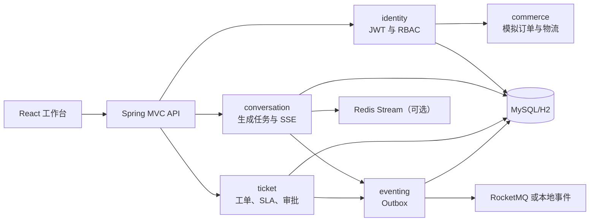

# SupportFlow AI 架构

项目是 Java 模块化单体。每个业务模块使用 `api -> application -> domain <- infrastructure` 分层，并由 Spring Modulith 与 ArchUnit 测试约束。

当前模块：`identity` 负责租户、成员和令牌；`commerce` 提供演示订单；`shared` 提供认证主体、租户上下文和公共错误协议。

认证成功后，JWT 被解析为 `AuthenticatedPrincipal`。HTTP 过滤器写入 `TenantContext`，并在请求结束时清理。业务 API 不接受客户端提供的 `tenantId`；带 `tenant_id` 的业务 SQL 由 MyBatis-Plus 租户拦截器自动限制。

跨模块依赖只允许公开根包契约或领域事件。例如 `identity.CustomerRegisteredEvent` 被 commerce 消费以初始化演示订单。

后台任务不共享任意 HTTP 请求的线程上下文。它们经 `shared.ActiveTenantProvider` 枚举活跃租户，并为每个租户短暂建立 `SYSTEM` 身份的 `TenantContext`，完成后在 `finally` 中清理。这样 Outbox 投递与 SLA 扫描仍受同一租户 SQL 拦截器约束，同时不让 `ticket` 或 `eventing` 依赖 identity 的内部端口。
