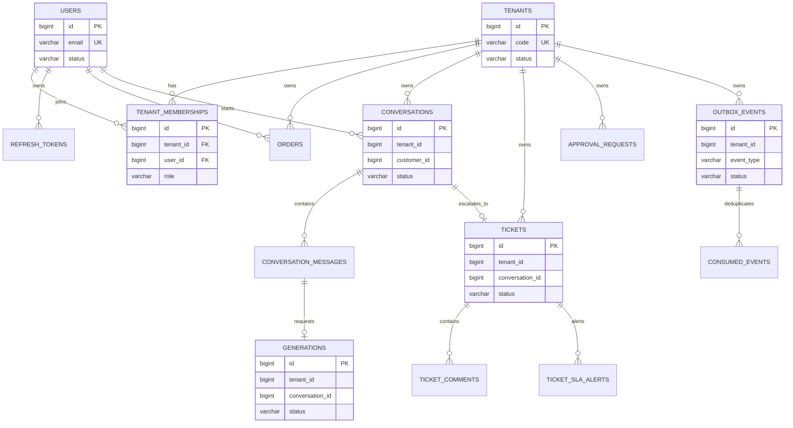

# SupportFlow AI ER 图

下图描述当前演示闭环的主要持久化实体。所有业务表均以 `tenant_id` 作为隔离键；身份基础表不使用该列，成员关系承担租户归属。

```mermaid
erDiagram
  TENANTS ||--o{ TENANT_MEMBERSHIPS : has
  USERS ||--o{ TENANT_MEMBERSHIPS : joins
  USERS ||--o{ REFRESH_TOKENS : owns
  TENANTS ||--o{ ORDERS : owns
  USERS ||--o{ ORDERS : places
  TENANTS ||--o{ CONVERSATIONS : owns
  USERS ||--o{ CONVERSATIONS : starts
  CONVERSATIONS ||--o{ CONVERSATION_MESSAGES : contains
  CONVERSATION_MESSAGES ||--o| GENERATIONS : requests
  TENANTS ||--o{ TICKETS : owns
  CONVERSATIONS ||--o| TICKETS : escalates_to
  TICKETS ||--o{ TICKET_COMMENTS : contains
  TICKETS ||--o{ TICKET_SLA_ALERTS : alerts
  TENANTS ||--o{ APPROVAL_REQUESTS : owns
  TENANTS ||--o{ OUTBOX_EVENTS : owns
  OUTBOX_EVENTS ||--o{ CONSUMED_EVENTS : deduplicates

  TENANTS { bigint id PK
            varchar code UK
            varchar status }
  USERS { bigint id PK
          varchar email UK
          varchar status }
  TENANT_MEMBERSHIPS { bigint id PK
                       bigint tenant_id FK
                       bigint user_id FK
                       varchar role }
  CONVERSATIONS { bigint id PK
                  bigint tenant_id
                  bigint customer_id
                  varchar status }
  GENERATIONS { bigint id PK
                bigint tenant_id
                bigint conversation_id
                varchar status }
  TICKETS { bigint id PK
            bigint tenant_id
            bigint conversation_id
            varchar status }
  OUTBOX_EVENTS { bigint id PK
                  bigint tenant_id
                  varchar event_type
                  varchar status }
```

前端 API 对所有雪花 ID 使用字符串表示，避免 JavaScript `Number` 的 53 位安全整数限制；服务端路径参数仍按 `Long` 处理。
